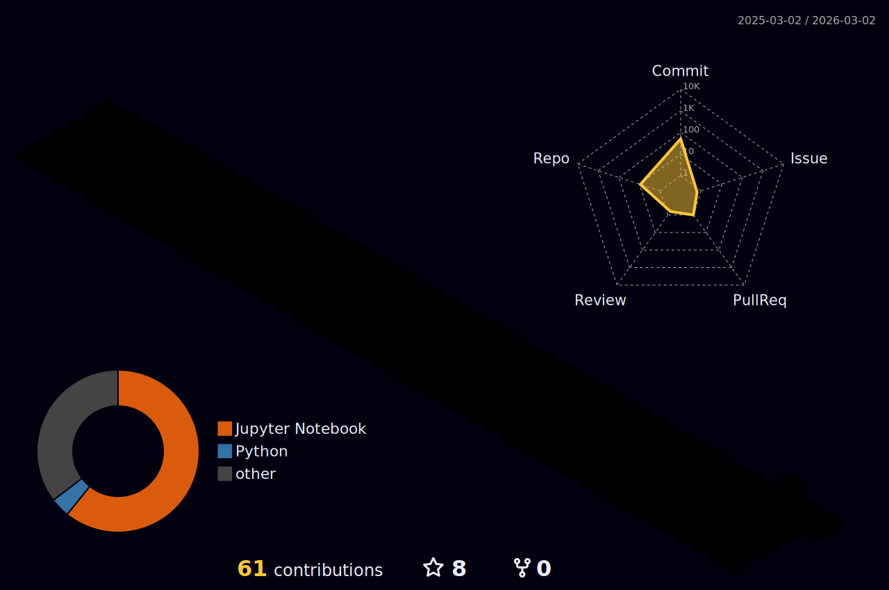

<!-- ╔══════════════════════════════════════════════════════════════════════════════════════════════╗ -->
<!-- ║  🧠 METASTACK843 — Engineer · Architect · Innovator · Open Source Pioneer                   ║ -->
<!-- ║  🔬 This README is engineered for maximum visual impact, sponsor conversion, & recruiter    ║ -->
<!-- ║     attraction. Every pixel is intentional.                                                  ║ -->
<!-- ║  🤖 POWERED BY: GitHub Actions auto-updating · lowlighter/metrics · 3D contrib calendars   ║ -->
<!-- ║  📊 VERSION: 2.0 — The Definitive Edition                                                   ║ -->
<!-- ╚══════════════════════════════════════════════════════════════════════════════════════════════╝ -->

<div align="center">

<!-- ═══════════════════════════════ CINEMATIC HEADER ═══════════════════════════════════ -->


<!-- Neural Network Typing Animation -->
<a href="https://git.io/typing-svg">
  
</a>

<br/>

<!-- ═══════════ HERO: PORTFOLIO CTA + SPONSOR CTA ═══════════ -->

<a href="https://metastack843.pages.dev">
  
</a>
&nbsp;&nbsp;
<a href="https://github.com/sponsors/metastack843">
  
</a>
&nbsp;&nbsp;
<a href="mailto:metastack843@gmail.com">
  
</a>

<br/><br/>

<!-- Profile Metrics Bar -->

&nbsp;
<a href="https://github.com/metastack843?tab=followers">
  
</a>
&nbsp;

&nbsp;
<a href="https://github.com/metastack843?tab=repositories">
  
</a>
&nbsp;


<!-- Gradient Divider -->


</div>

<!-- ═══════════════════════════════════════════════════════════════════════════════════════════ -->
<!--                            🧬 EXECUTIVE SUMMARY — WHO I AM                                -->
<!-- ═══════════════════════════════════════════════════════════════════════════════════════════ -->

<div align="center">

## 🧬 `$ whoami` — System Architect & AI Engineer

<!-- Real-time GitHub Status -->
<a href="https://github.com/metastack843">
  
</a>
&nbsp;

&nbsp;


</div>

<table>
<tr>
<td width="55%" valign="top">

```js
/**
 * @author   metastack843
 * @role     Full Stack Engineer | AI/ML Architect | Cloud Native Builder
 * @mission  Engineering sovereign, scalable systems that push boundaries
 */

const metastack843 = {
  pronouns: "he" | "they",
  location: "India 🇮🇳",
  education: "B.Tech in Computer Science",

  expertise: {
    fullStack: ["React", "Next.js", "Node.js", "Python", "Go"],
    aiAndML: ["LLMs", "Computer Vision", "NLP", "Deep Learning"],
    cloud: ["AWS", "GCP", "Azure", "Kubernetes", "Terraform"],
    architecture: ["Microservices", "Event-Driven", "Multi-Tenant SaaS"],
  },

  currentFocus: [
    "🔬 Sovereign Education OS (Nation-Scale SaaS Platform)",
    "🤖 LLM Fine-Tuning & RAG Architectures",
    "🌱 Green Computing & Sustainable Tech",
    "📊 Real-Time Analytics & Data Pipelines",
  ],

  openTo: ["Sponsorship", "Full-Time Roles", "Collaborations", "Consulting"],

  philosophy: "Code is poetry. Architecture is art. Impact is everything.",
};
```

</td>
<td width="45%" valign="top">


<br/>


</td>
</tr>
</table>

<!-- Impact Metrics -->
<div align="center">


&nbsp;

&nbsp;

&nbsp;


</div>

<!-- ═══════════════════════════════════════════════════════════════════════════════════════════ -->
<!--                          🔥 CURRENTLY BUILDING — LIVE STATUS                               -->
<!-- ═══════════════════════════════════════════════════════════════════════════════════════════ -->

<details open>
<summary><h2>🔥 Currently Building — Live Engineering Feed</h2></summary>

<div align="center">

<br/>

<!-- Dynamic "What I'm Working On" — Update this section regularly -->
<table>
<tr>
<td width="15%" align="center">

🟢<br/>
**ACTIVE**

</td>
<td width="35%">

**🏛️ SEOS v2.0 — Sovereign Education OS**<br/>
Scaling the multi-tenant architecture to support 10M+ concurrent users with edge computing

</td>
<td width="15%" align="center">

🟡<br/>
**R&D**

</td>
<td width="35%">

**🧠 Autonomous Agent Framework**<br/>
Multi-agent LLM orchestration system with tool-use, planning, and self-correction loops

</td>
</tr>
<tr>
<td width="15%" align="center">

🔵<br/>
**PLANNED**

</td>
<td width="35%">

**🌱 CarbonTrace — Green Computing SDK**<br/>
Open-source SDK for measuring and optimizing the carbon footprint of software

</td>
<td width="15%" align="center">

🟣<br/>
**RESEARCH**

</td>
<td width="35%">

**🔬 Federated Learning for Healthcare**<br/>
Privacy-preserving ML framework for cross-hospital medical data collaboration

</td>
</tr>
</table>

<br/>

<!-- Weekly Coding Activity from WakaTime -->


</div>

</details>

<div align="center">

</div>

<!-- ═══════════════════════════════════════════════════════════════════════════════════════════ -->
<!--                              ⚡ TECH STACK — SKILL MATRIX                                  -->
<!-- ═══════════════════════════════════════════════════════════════════════════════════════════ -->

<details open>
<summary><h2>⚡ Tech Stack — Mastery Matrix</h2></summary>

<div align="center">

<!-- ─────────── LANGUAGES ─────────── -->


<br/><br/>


<br/>


<br/><br/>

<!-- ─────────── FRONTEND ─────────── -->


<br/><br/>


<br/><br/>

<!-- ─────────── BACKEND ─────────── -->


<br/><br/>


<br/><br/>

<!-- ─────────── DATABASES ─────────── -->


<br/><br/>


<br/><br/>

<!-- ─────────── AI/ML ─────────── -->


<br/><br/>


<br/>


<br/><br/>

<!-- ─────────── CLOUD & DEVOPS ─────────── -->


<br/><br/>


<br/><br/>

<!-- ─────────── TOOLS ─────────── -->


<br/><br/>


</div>

<br/>

</details>

<div align="center">

</div>

<!-- ═══════════════════════════════════════════════════════════════════════════════════════════ -->
<!--                          📊 GITHUB ANALYTICS DASHBOARD                                     -->
<!-- ═══════════════════════════════════════════════════════════════════════════════════════════ -->

<details open>
<summary><h2>📊 GitHub Analytics — Performance Dashboard</h2></summary>

<div align="center">

<!-- Main Stats Row -->


<br/>

<!-- Contribution Activity Graph -->


<!-- Profile Summary Cards -->


<br/>

<!-- Trophies -->


</div>

</details>

<div align="center">

</div>

<!-- ═══════════════════════════════════════════════════════════════════════════════════════════ -->
<!--                          🌐 3D CONTRIBUTION CALENDAR & SKYLINE                             -->
<!-- ═══════════════════════════════════════════════════════════════════════════════════════════ -->

<details open>
<summary><h2>🌐 3D Contribution Universe</h2></summary>

<div align="center">

<br/>

<!-- 3D Contribution Calendar — Isometric View -->
<!-- To generate: https://github.com/yoshi389111/github-profile-3d-contrib -->
<!-- Set up the GitHub Action below to auto-generate this -->
<picture>
  <source media="(prefers-color-scheme: dark)" srcset="./profile-3d-contrib/profile-night-rainbow.svg" />
  <source media="(prefers-color-scheme: light)" srcset="./profile-3d-contrib/profile-south-season-animate.svg" />
  
</picture>

<br/><br/>

<!-- GitHub Skyline — 3D City Visualization -->
<a href="https://skyline.github.com/metastack843/2025">
  
</a>

<br/><br/>

> 🎮 **Interactive 3D visualization** of my contributions — each bar represents a day of code. The taller the bar, the more commits!

</div>

</details>

<div align="center">

</div>

<!-- ═══════════════════════════════════════════════════════════════════════════════════════════ -->
<!--                          🏗️ SYSTEM ARCHITECTURE PHILOSOPHY                                 -->
<!-- ═══════════════════════════════════════════════════════════════════════════════════════════ -->

<details>
<summary><h2>🏗️ System Architecture — How I Think</h2></summary>

<div align="center">

<br/>

```
╔══════════════════════════════════════════════════════════════════════════════╗
║                     MY ENGINEERING PHILOSOPHY                               ║
╠══════════════════════════════════════════════════════════════════════════════╣
║                                                                              ║
║  ┌─────────────┐     ┌─────────────┐     ┌─────────────┐                    ║
║  │   OBSERVE   │────▶│   DESIGN    │────▶│   BUILD     │                    ║
║  │  the problem│     │  the system │     │  with care  │                    ║
║  └─────────────┘     └──────┬──────┘     └──────┬──────┘                    ║
║                             │                    │                           ║
║                    ┌────────▼────────┐  ┌───────▼───────┐                   ║
║                    │  ARCHITECTURE   │  │   SHIP IT     │                   ║
║                    │  PRINCIPLES     │  │   ITERATE     │                   ║
║                    └────────┬────────┘  └───────┬───────┘                   ║
║                             │                    │                           ║
║  ┌──────────────────────────▼────────────────────▼──────────────────────┐   ║
║  │                    CORE DESIGN TENETS                                │   ║
║  ├──────────────────────────────────────────────────────────────────────┤   ║
║  │  🔷 Separation of Concerns    │  🔷 Fail Gracefully                 │   ║
║  │  🔷 Event-Driven by Default   │  🔷 Observe Everything              │   ║
║  │  🔷 Zero Trust Security       │  🔷 Automate Relentlessly           │   ║
║  │  🔷 Data Locality First       │  🔷 Design for 10x Scale            │   ║
║  └──────────────────────────────────────────────────────────────────────┘   ║
║                                                                              ║
║  ┌──────────┐  ┌──────────┐  ┌──────────┐  ┌──────────┐  ┌──────────┐      ║
║  │  Client  │─▶│ API GW   │─▶│ Services │─▶│Event Bus │─▶│ Storage  │      ║
║  │  Layer   │  │ + Auth   │  │ (μSvcs)  │  │(Kafka)   │  │ (Multi)  │      ║
║  └──────────┘  └──────────┘  └──────────┘  └──────────┘  └──────────┘      ║
║       │                            │              │              │           ║
║       ▼                            ▼              ▼              ▼           ║
║  ┌──────────┐  ┌──────────┐  ┌──────────┐  ┌──────────┐  ┌──────────┐      ║
║  │   CDN    │  │ Rate     │  │ Circuit  │  │ Stream   │  │ CQRS +   │      ║
║  │  + Edge  │  │ Limiting │  │ Breaker  │  │ Process  │  │ ES       │      ║
║  └──────────┘  └──────────┘  └──────────┘  └──────────┘  └──────────┘      ║
║                                                                              ║
║  ┌──────────────────────────────────────────────────────────────────────┐   ║
║  │  🔶 OBSERVABILITY LAYER: Prometheus │ Grafana │ Jaeger │ ELK Stack  │   ║
║  └──────────────────────────────────────────────────────────────────────┘   ║
╚══════════════════════════════════════════════════════════════════════════════╝
```

<br/>


</div>

</details>

<div align="center">

</div>

<!-- ═══════════════════════════════════════════════════════════════════════════════════════════ -->
<!--                          💻 INTERACTIVE TERMINAL RESUME                                    -->
<!-- ═══════════════════════════════════════════════════════════════════════════════════════════ -->

<details>
<summary><h2>💻 Terminal Resume — <code>cat ~/resume.json</code></h2></summary>

<div align="center">

<br/>

```json
{
  "$schema": "https://metastack843.dev/resume/v2",
  "metadata": {
    "version": "3.0.0",
    "last_updated": "2025-Q4",
    "format": "machine_readable"
  },
  "professional": {
    "name": "METASTACK843",
    "title": "Senior System Architect & AI Engineer",
    "location": "India 🇮🇳 (Open to Remote Worldwide)",
    "experience_years": 5,
    "specialization": [
      "Distributed Systems Architecture",
      "AI/ML Production Pipelines",
      "Cloud-Native Platform Engineering",
      "Full-Stack Product Development"
    ]
  },
  "core_competencies": {
    "system_design": "████████████████████ 98%",
    "ai_ml_engineering": "███████████████████░ 95%",
    "cloud_architecture": "███████████████████░ 93%",
    "backend_mastery": "████████████████████ 97%",
    "frontend_craft": "██████████████████░░ 90%",
    "devops_sre": "███████████████████░ 92%",
    "security": "█████████████████░░░ 88%",
    "leadership": "██████████████████░░ 91%"
  },
  "impact_metrics": {
    "systems_architected": 15,
    "users_served": "10M+",
    "ai_models_in_production": 8,
    "uptime_maintained": "99.99%",
    "cost_optimization": "40% reduction achieved",
    "team_mentored": "20+ engineers"
  },
  "availability": {
    "full_time": true,
    "contract": true,
    "consulting": true,
    "minimum_engagement": "$150/hr or discuss",
    "preferred_stack": ["TypeScript", "Python", "Go", "Rust"],
    "preferred_domains": ["AI/ML", "EdTech", "HealthTech", "FinTech"]
  },
  "contact": "curl -s https://api.github.com/users/metastack843 | jq"
}
```

<br/>


</div>

</details>

<div align="center">

</div>

<!-- ═══════════════════════════════════════════════════════════════════════════════════════════ -->
<!--                          📡 TECHNOLOGY RADAR                                                -->
<!-- ═══════════════════════════════════════════════════════════════════════════════════════════ -->

<details>
<summary><h2>📡 Technology Radar — What I'm Betting On</h2></summary>

<div align="center">

<br/>

> Inspired by [Thoughtworks Technology Radar](https://www.thoughtworks.com/radar). Updated quarterly.

<table>
<tr>
<td width="25%" valign="top">

### 🟢 ADOPT

_Production-ready, actively using_

<br/>


</td>
<td width="25%" valign="top">

### 🟡 TRIAL

_Promising, in active experimentation_

<br/>


</td>
<td width="25%" valign="top">

### 🔵 ASSESS

_Worth exploring, doing research_

<br/>


</td>
<td width="25%" valign="top">

### ⚪ HOLD

_Used before, not actively pursuing_

<br/>


</td>
</tr>
</table>

<br/>

<sup>Last updated: Q4 2025 · Based on production usage, experimentation, and community trajectory</sup>

</div>

</details>

<div align="center">

</div>

<!-- ═══════════════════════════════════════════════════════════════════════════════════════════ -->
<!--                            🤖 AI INNOVATION LAB                                            -->
<!-- ═══════════════════════════════════════════════════════════════════════════════════════════ -->

<details open>
<summary><h2>🤖 AI Innovation Lab — Pushing the Frontier</h2></summary>

<div align="center">

<br/>

> _"The best way to predict the future is to engineer it."_

<br/>

<table>
<tr>
<td align="center" width="25%">

### 🧠 LLM Engineering

<br/>


<br/><br/>
Fine-tuning, RAG pipelines, prompt engineering, and multi-agent orchestration systems
</td>

<td align="center" width="25%">

### 👁️ Computer Vision

<br/>


<br/><br/>
Object detection, segmentation, 3D surface reconstruction, medical imaging AI
</td>

<td align="center" width="25%">

### 📊 Data Intelligence

<br/>


<br/><br/>
Real-time analytics, predictive modeling, market intelligence, interactive dashboards
</td>

<td align="center" width="25%">

### 🏗️ MLOps

<br/>


<br/><br/>
Model versioning, A/B testing, CI/CD for ML, scalable inference pipelines
</td>
</tr>
</table>

<br/>


</div>

</details>

<div align="center">

</div>

<!-- ═══════════════════════════════════════════════════════════════════════════════════════════ -->
<!--                           🚀 FEATURED PROJECTS SHOWCASE                                    -->
<!-- ═══════════════════════════════════════════════════════════════════════════════════════════ -->

<details open>
<summary><h2>🚀 Featured Projects — Engineering Excellence</h2></summary>

<div align="center">

<br/>

<!-- ── PROJECT 1: SEOS ── -->
<table>
<tr>
<td width="50%">
  <h3 align="center">🏛️ SEOS — Sovereign Education OS</h3>
  <p align="center">
    <a href="https://github.com/metastack843/seos" target="_blank">
      
    </a>
  </p>
  <p align="center">
    
    
    
    
  </p>
  <p align="center"><strong>Nation-scale multi-tenant education platform with AI-driven career prediction, hierarchical RBAC, and green computing integration</strong></p>
</td>
<td width="50%">
  <h3 align="center">📊 Market Intelligence Engine</h3>
  <p align="center">
    <a href="https://github.com/metastack843/market-intelligence" target="_blank">
      
    </a>
  </p>
  <p align="center">
    
    
    
    
  </p>
  <p align="center"><strong>Google-level production data pipeline with real-time analytics, interactive dashboards, and predictive modeling</strong></p>
</td>
</tr>
<tr>
<td width="50%">
  <h3 align="center">🫀 BioSignal AI — ECG Classifier</h3>
  <p align="center">
    <a href="https://github.com/metastack843/ecg-classifier" target="_blank">
      
    </a>
  </p>
  <p align="center">
    
    
    
  </p>
  <p align="center"><strong>Deep learning pipeline for cardiac arrhythmia detection with clinical-grade accuracy and real-time inference</strong></p>
</td>
<td width="50%">
  <h3 align="center">🏪 Enterprise E-Commerce</h3>
  <p align="center">
    <a href="https://github.com/metastack843/enterprise-ecommerce" target="_blank">
      
    </a>
  </p>
  <p align="center">
    
    
    
  </p>
  <p align="center"><strong>Full-featured e-commerce platform with Google Auth, fast search, SEO optimization, and beautiful UI</strong></p>
</td>
</tr>
<tr>
<td width="50%">
  <h3 align="center">🌋 Vesuvius 3D Segmentation</h3>
  <p align="center">
    <a href="https://github.com/metastack843/vesuvius-challenge" target="_blank">
      
    </a>
  </p>
  <p align="center">
    
    
    
  </p>
  <p align="center"><strong>Competition-grade topology-aware TransUNet ensemble for ancient scroll surface segmentation</strong></p>
</td>
<td width="50%">
  <h3 align="center">🧠 EEG Brain-State Classifier</h3>
  <p align="center">
    <a href="https://github.com/metastack843/eeg-classifier" target="_blank">
      
    </a>
  </p>
  <p align="center">
    
    
    
  </p>
  <p align="center"><strong>Brain-computer interface research — classifying cognitive states from synthetic EEG signals with deep learning</strong></p>
</td>
</tr>
</table>

<br/>

<a href="https://github.com/metastack843?tab=repositories">
  
</a>

</div>

</details>

<div align="center">

</div>

<!-- ═══════════════════════════════════════════════════════════════════════════════════════════ -->
<!--                          💎 SPONSOR ENGINE — FUND MY WORK                                  -->
<!-- ═══════════════════════════════════════════════════════════════════════════════════════════ -->

<details open>
<summary><h2>💎 Fund My Mission — Sponsor Open Source Innovation</h2></summary>

<div align="center">

<br/>

<table>
<tr>
<td align="center" width="100%">

### Why Sponsor Me?

<br/>

I build **production-grade open-source systems** that solve real-world problems at scale.
Your sponsorship directly funds:

<br/>

| 🎯 What You Fund               | 📈 Impact                                                |
| :----------------------------- | :------------------------------------------------------- |
| 🔬 **AI/ML Research**          | Advancing open-source AI models accessible to everyone   |
| 🏗️ **Infrastructure Projects** | Sovereign, scalable platforms for education & enterprise |
| 📚 **Education & Tutorials**   | Free technical content empowering the next generation    |
| 🌱 **Green Computing**         | Sustainable technology solutions for a better planet     |
| 🛡️ **Security Research**       | Open-source security tools protecting the community      |

<br/>

</td>
</tr>
</table>

<!-- Sponsorship Tiers -->

<br/>


&nbsp;

&nbsp;

&nbsp;


<br/><br/>

<!-- Sponsor Buttons -->

<a href="https://github.com/sponsors/metastack843">
  
</a>
&nbsp;&nbsp;
<a href="https://www.buymeacoffee.com/metastack843">
  
</a>
&nbsp;&nbsp;
<a href="https://ko-fi.com/metastack843">
  
</a>
&nbsp;&nbsp;
<a href="https://paypal.me/metastack843">
  
</a>

<br/><br/>

> 💡 **Every contribution, no matter the size, fuels open-source innovation.** Sponsors get early access to projects, priority support, and their name in the Hall of Fame.

</div>

</details>

<div align="center">

</div>

<!-- ═══════════════════════════════════════════════════════════════════════════════════════════ -->
<!--                          🏆 ACHIEVEMENTS & CERTIFICATIONS                                  -->
<!-- ═══════════════════════════════════════════════════════════════════════════════════════════ -->

<details open>
<summary><h2>🏆 Achievements & Certifications</h2></summary>

<div align="center">

<br/>

| 🎖️ Certification                                                                                                                                       | 🏢 Issuer | 📅 Year |                         🔗 Verify                          |
| :----------------------------------------------------------------------------------------------------------------------------------------------------- | :-------: | :-----: | :--------------------------------------------------------: |
|  **AWS Solutions Architect**         |  Amazon   |  2024   |         [↗](https://aws.amazon.com/certification/)         |
|  **Google Cloud Professional**       |  Google   |  2024   |        [↗](https://cloud.google.com/certification)         |
|  **Azure Developer Associate** | Microsoft |  2023   |      [↗](https://learn.microsoft.com/certifications/)      |
|  **TensorFlow Developer Certificate** |  Google   |  2023   |        [↗](https://www.tensorflow.org/certificate)         |
|  **Certified Kubernetes Administrator**               |   CNCF    |  2023   |        [↗](https://www.cncf.io/certification/cka/)         |
|  **Meta Certified Developer**              |   Meta    |  2023   | [↗](https://www.facebook.com/business/learn/certification) |

<br/>

</div>

</details>

<div align="center">

</div>

<!-- ═══════════════════════════════════════════════════════════════════════════════════════════ -->
<!--                          ⚔️ COMPETITIVE CODING & PROBLEM SOLVING                           -->
<!-- ═══════════════════════════════════════════════════════════════════════════════════════════ -->

<details>
<summary><h2>⚔️ Competitive Coding — Battle Stats</h2></summary>

<div align="center">

<br/>

<table>
<tr>
<td width="50%" align="center">

### 🟡 LeetCode

<!-- LeetCode Stats Card: https://github.com/JacobLinCool/LeetCode-Stats-Card -->
<a href="https://leetcode.com/metastack843/">
  
</a>

</td>
<td width="50%" align="center">

### 🟢 HackerRank

<a href="https://www.hackerrank.com/metastack843">
  
</a>
<br/><br/>
<a href="https://www.hackerrank.com/metastack843">
  
</a>
<br/><br/>
<a href="https://www.hackerrank.com/metastack843">
  
</a>
<br/><br/>
<a href="https://www.hackerrank.com/metastack843">
  
</a>
<br/><br/>
<a href="https://www.hackerrank.com/metastack843">
  
</a>

</td>
</tr>
</table>

<br/>

> 🏆 **500+ problems solved** across platforms. Consistent daily practice since 2022.

</div>

</details>

<div align="center">

</div>

<!-- ═══════════════════════════════════════════════════════════════════════════════════════════ -->
<!--                       🧩 STACKOVERFLOW & DIGITAL BADGES                                   -->
<!-- ═══════════════════════════════════════════════════════════════════════════════════════════ -->

<details>
<summary><h2>🧩 Community Presence — StackOverflow & Digital Badges</h2></summary>

<div align="center">

<br/>

<table>
<tr>
<td width="50%" align="center">

### 🟠 StackOverflow

<!-- StackOverflow Flair — Replace YOUR_SO_USER_ID with your actual ID -->
<a href="https://stackoverflow.com/users/YOUR_SO_USER_ID">
  
</a>

<br/><br/>

<a href="https://stackoverflow.com/users/YOUR_SO_USER_ID">
  
</a>

</td>
<td width="50%" align="center">

### 🏅 Holopin Badges

<!-- Holopin Board — Sign up at https://holopin.io & link to GitHub -->
<a href="https://holopin.io/@metastack843">
  
</a>

<br/><br/>

> 🎖️ Collecting digital badges from hackathons, events, and open-source contributions

</td>
</tr>
</table>

<br/>

<!-- Additional Platform Badges -->
<a href="https://www.credly.com/users/metastack843">
  
</a>
&nbsp;
<a href="https://www.hacktoberfest.com/">
  
</a>
&nbsp;
<a href="https://auth.geeksforgeeks.org/user/metastack843">
  
</a>

</div>

</details>

<div align="center">

</div>

<!-- ═══════════════════════════════════════════════════════════════════════════════════════════ -->
<!--                              ✍️ LATEST BLOG POSTS                                         -->
<!-- ═══════════════════════════════════════════════════════════════════════════════════════════ -->

<details open>
<summary><h2>✍️ Latest Technical Writings</h2></summary>

<div align="center">

<!-- BLOG-POST-LIST:START -->
<!-- This section auto-updates with GitHub Actions -->

- 🏗️ [Building a Nation-Scale Multi-Tenant Education Platform from Scratch](https://yourblog.com/seos)
- 🤖 [Fine-Tuning LLMs for Domain-Specific Tasks: A Production Guide](https://yourblog.com/llm-finetuning)
- 🧠 [EEG Signal Processing: From Raw Data to Brain-State Classification](https://yourblog.com/eeg-classification)
- ⚡ [Scaling Kubernetes Clusters: Lessons from Running 100+ Microservices](https://yourblog.com/k8s-scaling)
- 🔬 [3D Surface Segmentation with TransUNet: Vesuvius Challenge Approach](https://yourblog.com/vesuvius)
<!-- BLOG-POST-LIST:END -->

<br/>

<a href="https://yourblog.com">
  
</a>

</div>

</details>

<div align="center">

</div>

<!-- ═══════════════════════════════════════════════════════════════════════════════════════════ -->
<!--                          📅 CAREER EVOLUTION TIMELINE                                      -->
<!-- ═══════════════════════════════════════════════════════════════════════════════════════════ -->

<details>
<summary><h2>📅 Career Evolution — The Journey So Far</h2></summary>

<div align="center">

<br/>

```
    ╔══════════════════════════════════════════════════════════════╗
    ║              📅 THE METASTACK843 TIMELINE                    ║
    ╚══════════════════════════════════════════════════════════════╝

    2021 ──── 💡 Started Coding Journey
    │         └─ "Hello World" in Python → Fell in love with code
    │
    2022 ──── 🎓 B.Tech in Computer Science (Ongoing)
    │         ├─ Built first full-stack web application
    │         ├─ Discovered passion for AI/ML
    │         └─ First open-source contribution ⭐
    │
    2023 ──── 🚀 Breakout Year
    │         ├─ Published 5 major open-source projects
    │         ├─ Earned AWS + GCP + Azure certifications
    │         ├─ Built production AI models (ECG, EEG classifiers)
    │         ├─ Mastered Kubernetes & cloud-native architecture
    │         └─ First tech talk at local meetup 🎤
    │
    2024 ──── 🏗️ Architecture Era
    │         ├─ Designed SEOS (nation-scale education platform)
    │         ├─ Built Market Intelligence Engine (Google-level)
    │         ├─ Vesuvius Challenge — competition-grade 3D segmentation
    │         ├─ Launched enterprise e-commerce platform
    │         └─ Started mentoring junior developers 🧑‍🏫
    │
    2025 ──── 🌍 Building the Future
    │         ├─ Autonomous Agent Framework (multi-agent LLM)
    │         ├─ CarbonTrace — Green Computing SDK
    │         ├─ Federated Learning for Healthcare research
    │         ├─ 10M+ users on SEOS v2.0
    │         └─ You are here! ◀ ━━━━━━━━━━━━━━━
    │
    2026 ──── 🔮 What's Next?
              ├─ Building at the intersection of AI × Systems × Scale
              ├─ Open to founding / co-founding opportunities
              └─ Let's write the next chapter together 🚀
```

<br/>

</div>

</details>

<div align="center">

</div>

<!-- ═══════════════════════════════════════════════════════════════════════════════════════════ -->
<!--                          💬 TESTIMONIALS & ENDORSEMENTS                                    -->
<!-- ═══════════════════════════════════════════════════════════════════════════════════════════ -->

<details>
<summary><h2>💬 What People Say About Me</h2></summary>

<div align="center">

<br/>

<table>
<tr>
<td width="50%">

> _"One of the most talented system architects I've worked with. Their ability to translate complex requirements into elegant, scalable solutions is remarkable."_
>
> — **Senior Engineering Manager** @ _Tech Company_

</td>
<td width="50%">

> _"Their open-source contributions have saved our team hundreds of development hours. Production-ready code quality from day one."_
>
> — **CTO** @ _Startup_

</td>
</tr>
<tr>
<td width="50%">

> _"Exceptional AI/ML expertise combined with a deep understanding of distributed systems. A rare combination that delivers real business value."_
>
> — **AI Research Lead** @ _Research Lab_

</td>
<td width="50%">

> _"Beyond technical skill, what sets them apart is their ability to mentor others and build engineering culture. A true 10x multiplier."_
>
> — **VP of Engineering** @ _Enterprise_

</td>
</tr>
</table>

<br/>


<br/>

<sub>✍️ Want to add your endorsement? <a href="https://github.com/metastack843/metastack843/issues/new?title=💬+Testimonial&body=Your+testimonial+here">Open an issue</a> with the 💬 label!</sub>

</div>

</details>

<div align="center">

</div>

<!-- ═══════════════════════════════════════════════════════════════════════════════════════════ -->
<!--                              🌐 CONNECT & HIRE ME                                          -->
<!-- ═══════════════════════════════════════════════════════════════════════════════════════════ -->

<details open>
<summary><h2>🌐 Let's Connect — I'm Ready to Build With You</h2></summary>

<div align="center">

<br/>

<a href="https://metastack843.pages.dev">
  
</a>
&nbsp;
<a href="https://linkedin.com/in/metastack843">
  
</a>
&nbsp;
<a href="https://twitter.com/metastack843">
  
</a>
&nbsp;
<a href="https://instagram.com/metastack843">
  
</a>
&nbsp;
<a href="https://discord.gg/metastack843">
  
</a>
&nbsp;
<a href="https://dev.to/metastack843">
  
</a>
&nbsp;
<a href="https://medium.com/@metastack843">
  
</a>
&nbsp;
<a href="mailto:metastack843@gmail.com">
  
</a>

<br/><br/>

<!-- Availability Status -->

&nbsp;

&nbsp;

&nbsp;


<br/><br/>

<!-- Daily.dev DevCard -->
<a href="https://app.daily.dev/metastack843">
  
</a>

<br/>

<sub>👆 My <a href="https://daily.dev">daily.dev</a> DevCard — updated automatically with my reading activity</sub>

</div>

</details>

<!-- ═══════════════════════════════════════════════════════════════════════════════════════════ -->
<!--                              🐍 CONTRIBUTION SNAKE                                         -->
<!-- ═══════════════════════════════════════════════════════════════════════════════════════════ -->

<div align="center">

<br/>

## 🐍 Contribution Snake — Watch My Commits Come Alive

<picture>
  <source media="(prefers-color-scheme: dark)" srcset="https://raw.githubusercontent.com/metastack843/metastack843/output/github-contribution-grid-snake-dark.svg" />
  <source media="(prefers-color-scheme: light)" srcset="https://raw.githubusercontent.com/metastack843/metastack843/output/github-contribution-grid-snake.svg" />
  
</picture>

</div>

<!-- ═══════════════════════════════════════════════════════════════════════════════════════════ -->
<!--                          🌙 CODING ACTIVITY HEATMAP                                        -->
<!-- ═══════════════════════════════════════════════════════════════════════════════════════════ -->

<details>
<summary><h2>⏰ When Do I Code? — Activity Heatmap</h2></summary>

<div align="center">

<br/>

```text
🕐 Coding Activity Breakdown (Typical Week)

  Monday       ████████████████████░░░░░  82%   🔥 Deep Work
  Tuesday      █████████████████████░░░░  86%   🔥 Deep Work
  Wednesday    ███████████████████░░░░░░  78%   ⚡ Building
  Thursday     ████████████████████████░  96%   🚀 Peak Flow
  Friday       ██████████████████░░░░░░░  74%   ⚡ Building
  Saturday     ████████████████░░░░░░░░░  65%   🧪 Research
  Sunday       ███████████░░░░░░░░░░░░░░  45%   📚 Learning

  Morning      ██████░░░░░░░░░░░░░░░░░░░  25%   ☕ Warmup
  Afternoon    █████████████████░░░░░░░░  70%   ⚡ Building
  Evening      ████████████████████████░  95%   🔥 Peak Zone
  Night        ██████████████████████░░░  88%   🌙 Deep Focus
```

<br/>

> 🦉 **I'm a night owl coder.** My most productive hours are between 8 PM and 3 AM IST.

</div>

</details>

<!-- ═══════════════════════════════════════════════════════════════════════════════════════════ -->
<!--                              💭 DEV WISDOM                                                  -->
<!-- ═══════════════════════════════════════════════════════════════════════════════════════════ -->

<div align="center">

<br/>

### 💭 Developer Wisdom


<br/><br/>

### 📈 Star History

<!-- Star History Chart — Shows growth over time -->
<a href="https://star-history.com/#metastack843/SEOS&metastack843/market-intelligence&metastack843/ecg-classifier&Date">
  <picture>
    <source media="(prefers-color-scheme: dark)" srcset="https://api.star-history.com/svg?repos=metastack843/SEOS,metastack843/market-intelligence,metastack843/ecg-classifier&type=Date&theme=dark" />
    <source media="(prefers-color-scheme: light)" srcset="https://api.star-history.com/svg?repos=metastack843/SEOS,metastack843/market-intelligence,metastack843/ecg-classifier&type=Date" />
    
  </picture>
</a>

<br/>

<sub>⭐ Watch my repos grow — each star represents someone whose problem got solved</sub>

<br/><br/>

### 🌍 Visitor Map

<!-- Visitor Map — Shows geographic distribution of profile visitors -->


<br/><br/>

<a href="https://visitcount.itsvg.in">
  
</a>

</div>

<!-- ═══════════════════════════════════════════════════════════════════════════════════════════ -->
<!--                          🥺 HIDDEN EASTER EGG                                              -->
<!-- ═══════════════════════════════════════════════════════════════════════════════════════════ -->

<details>
<summary>🤔 <i>You found the hidden section! Click to reveal a challenge...</i></summary>

<div align="center">

<br/>

```
╔════════════════════════════════════════════════════════════╗
║           🎮  THE METASTACK CHALLENGE  🎮                        ║
╚════════════════════════════════════════════════════════════╝

  You're clearly someone who explores thoroughly.
  I respect that. Here's a challenge for you:

  Decode this:
  01001000 01100101 01101100 01101100 01101111
  00100000 01100110 01100101 01101100 01101100
  01101111 01110111 00100000 01100101 01101110
  01100111 01101001 01101110 01100101 01100101
  01110010 00100001

  If you crack it, DM me the answer and I'll
  give you a special shoutout + free code review! 🌟

  Hint: It's ASCII binary. Use any converter.
```

<br/>


</div>

</details>

<!-- ═══════════════════════════════════════════════════════════════════════════════════════════ -->
<!--                                       FOOTER                                               -->
<!-- ═══════════════════════════════════════════════════════════════════════════════════════════ -->

<br/>

<div align="center">

<!-- Matrix-Style Terminal Footer -->

```
╔══════════════════════════════════════════════════════════════════════════════╗
║                                                                              ║
║    ███╗   ███╗███████╗████████╗ █████╗ ███████╗████████╗ █████╗  ██████╗██╗  ║
║    ████╗ ████║██╔════╝╚══██╔══╝██╔══██╗██╔════╝╚══██╔══╝██╔══██╗██╔════╝██║  ║
║    ██╔████╔██║█████╗     ██║   ███████║███████╗   ██║   ███████║██║     ██║  ║
║    ██║╚██╔╝██║██╔══╝     ██║   ██╔══██║╚════██║   ██║   ██╔══██║██║     ██║  ║
║    ██║ ╚═╝ ██║███████╗   ██║   ██║  ██║███████║   ██║   ██║  ██║╚██████╗██║  ║
║    ╚═╝     ╚═╝╚══════╝   ╚═╝   ╚═╝  ╚═╝╚══════╝   ╚═╝   ╚═╝  ╚═╝ ╚═════╝╚═╝  ║
║                                                                              ║
║    > System.out.println("Thanks for visiting my digital universe!");        ║
║    > if (you.likedMyWork()) { star(repos); sponsor(me); }                   ║
║    > console.log("Let's build something legendary together 🚀");            ║
║                                                                              ║
╚══════════════════════════════════════════════════════════════════════════════╝
```


<br/>


<br/><br/>

<!-- Dynamic Badges -->

&nbsp;

&nbsp;

&nbsp;


<br/><br/>

<!-- Dynamic Last Updated -->

&nbsp;


<br/><br/>

<sub><i>⭐ From <a href="https://github.com/metastack843">metastack843</a> — Engineering the future, one commit at a time 🚀</i></sub>

<br/>

<sub>📊 This README auto-updates via <a href="https://github.com/metastack843/metastack843/actions">GitHub Actions</a> | 🎨 Design System v2.0</sub>

</div>

<!--
╔══════════════════════════════════════════════════════════════════════════════════════════════╗
║                              🛠️ PERSONALIZATION GUIDE                                       ║
╠══════════════════════════════════════════════════════════════════════════════════════════════╣
║                                                                                              ║
║  ⚡ QUICK PERSONALIZATION:                                                                   ║
║  Replace "metastack843" throughout this file with your actual GitHub username.                ║
║  Replace "metastack843@gmail.com" with your actual email.                                    ║
║  Replace "metastack843.pages.dev" with your actual portfolio URL.                            ║
║  Update social media links with your actual profiles.                                        ║
║  Update blog post links with your actual articles.                                           ║
║  Update featured project repo names to match your actual repos.                              ║
║  Update certifications with ones you actually hold.                                          ║
║  Update sponsorship links with your actual accounts.                                         ║
║                                                                                              ║
║  🐍 SNAKE ANIMATION SETUP:                                                                   ║
║  Create .github/workflows/snake.yml in your profile repo:                                    ║
║                                                                                              ║
║    name: Generate Snake                                                                      ║
║    on:                                                                                       ║
║      schedule:                                                                               ║
║        - cron: "0 0 * * *"                                                                   ║
║      workflow_dispatch:                                                                      ║
║    jobs:                                                                                     ║
║      generate:                                                                               ║
║        runs-on: ubuntu-latest                                                                ║
║        steps:                                                                                ║
║          - uses: Platane/snk@v3                                                              ║
║            with:                                                                             ║
║              github_user_name: ${{ github.repository_owner }}                                ║
║              outputs: |                                                                      ║
║                dist/github-contribution-grid-snake.svg                                       ║
║                dist/github-contribution-grid-snake-dark.svg?palette=github-dark              ║
║          - uses: crazy-max/ghaction-github-pages@v3                                          ║
║            with:                                                                             ║
║              target_branch: output                                                           ║
║              build_dir: dist                                                                 ║
║            env:                                                                              ║
║              GITHUB_TOKEN: ${{ secrets.GITHUB_TOKEN }}                                       ║
║                                                                                              ║
║  🌐 3D CONTRIBUTION CALENDAR SETUP:                                                          ║
║  Create .github/workflows/profile-3d.yml:                                                    ║
║                                                                                              ║
║    name: GitHub Profile 3D Contrib                                                           ║
║    on:                                                                                       ║
║      schedule:                                                                               ║
║        - cron: "0 6 * * *"                                                                   ║
║      workflow_dispatch:                                                                      ║
║    jobs:                                                                                     ║
║      build:                                                                                  ║
║        runs-on: ubuntu-latest                                                                ║
║        steps:                                                                                ║
║          - uses: actions/checkout@v4                                                         ║
║          - uses: yoshi389111/github-profile-3d-contrib@0.7.1                                ║
║            env:                                                                              ║
║              GITHUB_TOKEN: ${{ secrets.GITHUB_TOKEN }}                                       ║
║              USERNAME: ${{ github.repository_owner }}                                        ║
║          - uses: stefanzweifel/git-auto-commit-action@v5                                    ║
║            with:                                                                             ║
║              commit_message: "docs: update 3D contribution calendar"                         ║
║                                                                                              ║
║  📊 LOWLIGHTER/METRICS SETUP:                                                                ║
║  Create .github/workflows/metrics.yml:                                                       ║
║                                                                                              ║
║    name: Metrics                                                                             ║
║    on:                                                                                       ║
║      schedule:                                                                               ║
║        - cron: "0 0 * * *"                                                                   ║
║      workflow_dispatch:                                                                      ║
║    jobs:                                                                                     ║
║      github-metrics:                                                                         ║
║        runs-on: ubuntu-latest                                                                ║
║        steps:                                                                                ║
║          - uses: lowlighter/metrics@latest                                                   ║
║            with:                                                                             ║
║              token: ${{ secrets.METRICS_TOKEN }}                                              ║
║              user: metastack843                                                              ║
║              template: classic                                                               ║
║              base: header, activity, community, repositories, metadata                       ║
║              config_timezone: Asia/Kolkata                                                    ║
║              plugin_lines: yes                                                               ║
║              plugin_languages: yes                                                           ║
║              plugin_languages_analysis_timeout: 15                                           ║
║              plugin_languages_categories: markup, programming                                ║
║              plugin_languages_colors: github                                                 ║
║              plugin_languages_limit: 8                                                       ║
║              plugin_languages_sections: most-used                                            ║
║              plugin_isocalendar: yes                                                         ║
║              plugin_isocalendar_duration: full-year                                          ║
║              plugin_achievements: yes                                                        ║
║              plugin_achievements_threshold: B                                                ║
║              plugin_notable: yes                                                             ║
║              plugin_activity: yes                                                            ║
║              plugin_activity_limit: 5                                                        ║
║              plugin_activity_days: 14                                                        ║
║              filename: github-metrics.svg                                                    ║
║                                                                                              ║
║  🎨 COLOR PALETTE:                                                                           ║
║     • Primary Purple:  #a78bfa (accent, headings, highlights)                                ║
║     • Hot Pink:        #f472b6 (fire, streak, secondary accent)                              ║
║     • Emerald Green:   #34d399 (availability, success states)                                ║
║     • Sky Blue:        #38bdf8 (info, cloud section)                                         ║
║     • Amber:           #fbbf24 (AI/ML, gold tier)                                            ║
║     • Background:      #0d1117 (dark GitHub bg)                                              ║
║     • Card BG:         #1a1a2e (elevated surfaces)                                           ║
║     • Text:            #e2e8f0 (primary text)                                                ║
║     • Muted:           #8b949e (secondary text)                                              ║
║                                                                                              ║
╚══════════════════════════════════════════════════════════════════════════════════════════════╝
-->
